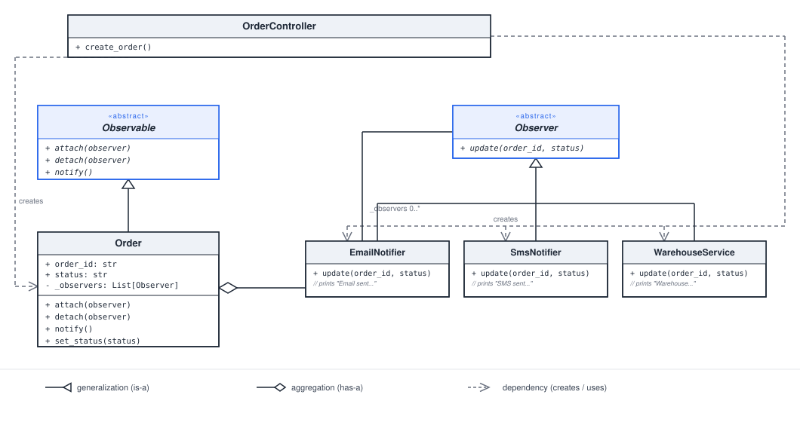
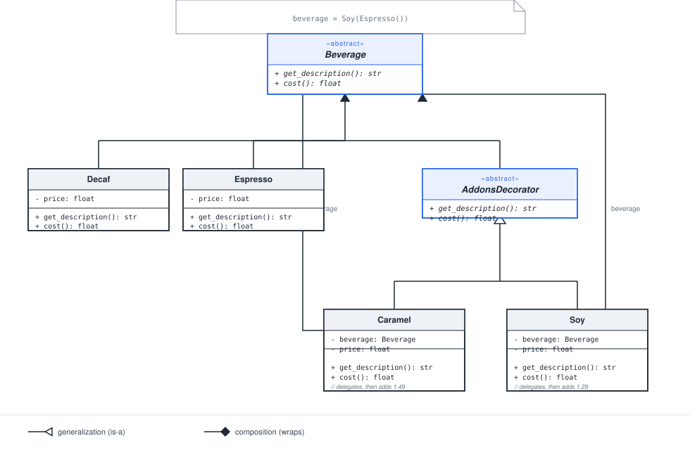
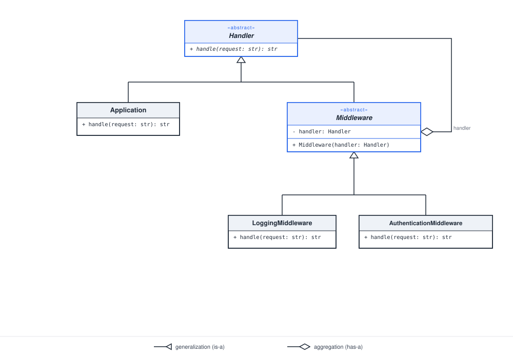

# Design Patterns

Personal notes and Python implementations while learning design patterns —
mainly the classic Gang of Four patterns, applied to small, concrete
examples rather than studied in the abstract.

## Patterns covered so far

| Pattern | File | Example |
|---|---|---|
| **Strategy** | `00_strategy.py` | Swapping discount calculation logic (regular/VIP/premium/first-order-promo) at runtime instead of branching on customer type. |
| **Observer** | `01_observer.py` | An `Order` notifying `EmailNotifier`, `SmsNotifier`, and `WarehouseService` whenever its status changes, without knowing any of them exist. |
| **Decorator** (beverage) | `02_decorator_beverage.py` | Wrapping a `Beverage` with add-ons (`Caramel`, `Soy`) at runtime — each decorator delegates to the wrapped object, then adds its own price. |
| **Decorator** (HTTP middleware) | `03_decorator_middleware.py` | An HTTP `Handler` wrapped by stackable `Middleware` (`LoggingMiddleware`, `AuthenticationMiddleware`) — each one delegates to the wrapped handler, and `AuthenticationMiddleware` can short-circuit the chain instead of delegating. |

More patterns will be added here as I work through them.
