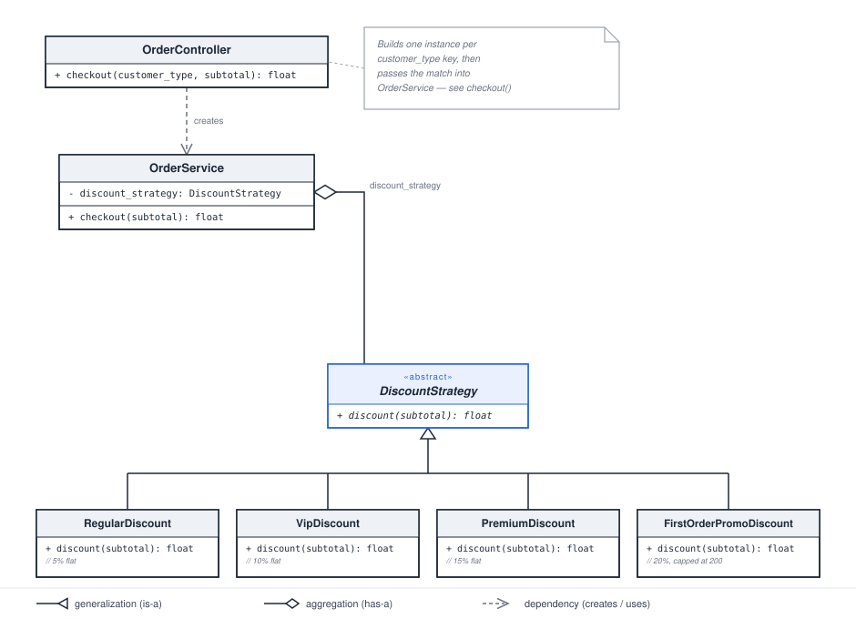

# Design Patterns

Personal notes and Python implementations while learning design patterns —
mainly the classic Gang of Four patterns, applied to small, concrete
examples rather than studied in the abstract.

## Patterns covered so far

| Pattern | File | Example |
|---|---|---|
| **Strategy** | `00_strategy.py` | Swapping discount calculation logic (regular/VIP/premium/first-order-promo) at runtime instead of branching on customer type. |
| **Observer** | `01_observer.py` | An `Order` notifying `EmailNotifier`, `SmsNotifier`, and `WarehouseService` whenever its status changes, without knowing any of them exist. |

More patterns will be added here as I work through them.
